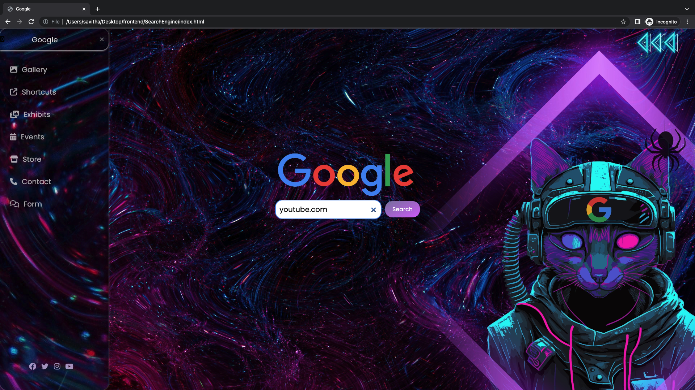

# Google Search Page Clone

This project is a simple clone of the Google search homepage. It includes a search bar and a responsive sidebar menu with links to various Google services. The project is created using HTML and CSS.

## Table of Contents

- [Demo](#demo)
- [Features](#features)
- [Usage](#usage)
- [Screenshots](#screenshots)

## Demo

You can view a live demo of this project at [Google Search Page Clone Demo](https:).

## Features

- Google search bar with a search button.
- Responsive sidebar menu with links to Google services.
- Stylish and functional design.
- Clicking the menu icon on the top-left opens and closes the sidebar.
- Social media links in the sidebar.

## Screenshots 

